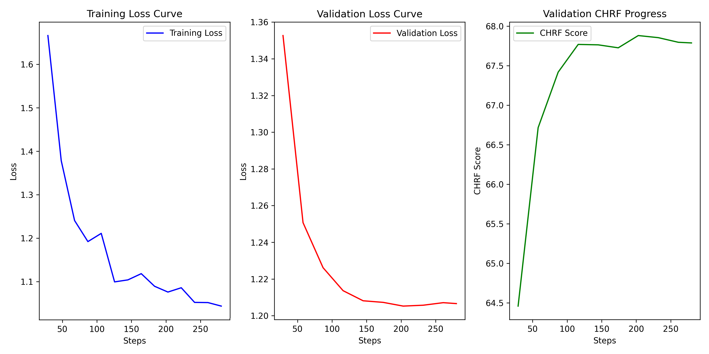

# Training analysis

Here are the plots of training and validation loss and chrf metric during training.

The graphic above displays three subplots:

1. **Training Loss Curve (Left Plot):**
   - The curve shows a clear downward trend from around 1.6–1.7 at the start to roughly 0.8–0.9 by the end of training.
   - This steady decrease indicates that the model is progressively learning and fitting the training data better over time.
   - The absence of any plateau or upward spike suggests that there are no immediate signs of underfitting or overfitting at the training level.

2. **Validation Loss Curve (Center Plot):**
   - The validation loss starts around 1.36 and drops steadily to around 1.20 (or slightly lower).
   - This decreasing trend mirrors the training loss, indicating that the model is generalizing well and not merely overfitting.
   - The smooth decline in validation loss points to well-chosen training hyperparameters that ensure stable convergence.

3. **Validation CHRF Progress (Right Plot):**
   - The CHRF score begins around 64.5 and rises to nearly 68.0 or above.
   - As CHRF measures text similarity, this upward trend suggests that the generated code is becoming increasingly similar to the reference solutions.
   - The improvement in CHRF aligns well with the reduction in validation loss, both signaling that the model is learning to produce more accurate outputs.

## Overall Observations

- **Consistent Improvement:** Both training and validation losses decrease steadily while the validation CHRF metric increases, indicating balanced progress in learning and generalization.
- **No Overfitting Signs:** There is no significant divergence between the training and validation curves, which is a positive sign of the model's stability.

However, as the size of the fine tuning dataset wasn't particurarly high (500 total examples) and the training took only 10 epochs, the model probably did not gain any new code writing skills.
It is however interesting to see the change in similarity, because the based model was not adapted to be the interactive assistant, just the raw next token generator (at least in the llama version I have used).